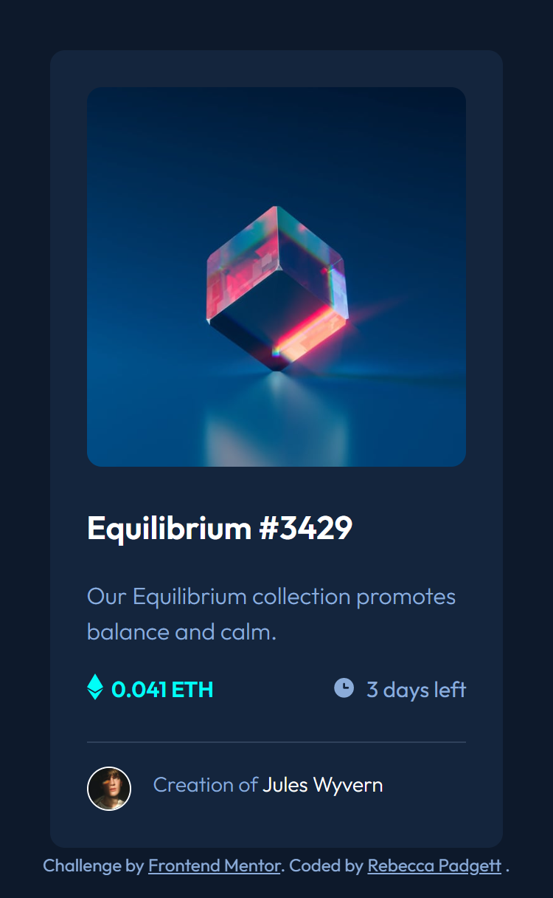

# Frontend Mentor - NFT preview card component solution

This is a solution to the [NFT preview card component challenge on Frontend Mentor](https://www.frontendmentor.io/challenges/nft-preview-card-component-SbdUL_w0U). Frontend Mentor challenges help you improve your coding skills by building realistic projects.

## Table of contents

- [Overview](#overview)
  - [The challenge](#the-challenge)
  - [Screenshot](#screenshot)
  - [Links](#links)
- [My process](#my-process)
  - [Built with](#built-with)
  - [What I learned](#what-i-learned)
- [Author](#author)
- [Acknowledgments](#Acknowledgments)

## Overview

### The challenge

Users should be able to:

- View the optimal layout depending on their device's screen size
- See hover states for interactive elements

### Screenshot



### Links

- Solution URL: [Frontend Mentor](https://www.frontendmentor.io/solutions/nft-preview-card-component-using-html-and-css-fvpriDTSeQ)
- Live Site URL: [Github Pages](https://bccpadge.github.io/nft-preview-card-component/)

## My process

### Built with

- Semantic HTML5 markup
- CSS custom properties (variables)
- Flexbox
- CSS Grid
- Mobile-first workflow

### What I learned

I learned how to use the after pseudo-element to add the icon view image in CSS only.

```css
.nft-banner::after {
  --accent-clr-alt: hsla(178, 100%, 50%, 0.5);
  content: url("../images/icon-view.svg");
  position: absolute;
  inset: 0;
  background-color: var(--accent-clr-alt);
  display: flex;
  justify-content: center;
  align-items: center;
  opacity: 0;
  transition: opacity var(--transition);
}
```

## Author

- Frontend Mentor - [@bccpadge](https://www.frontendmentor.io/profile/bccpadge)
- Github - [@bccpadge](https://www.github/bccpadge)

## Acknowledgments

I used this Youtube [nft preview card component](https://www.youtube.com/watch?v=dyf3aLZ7Dyo) video tutorial.
